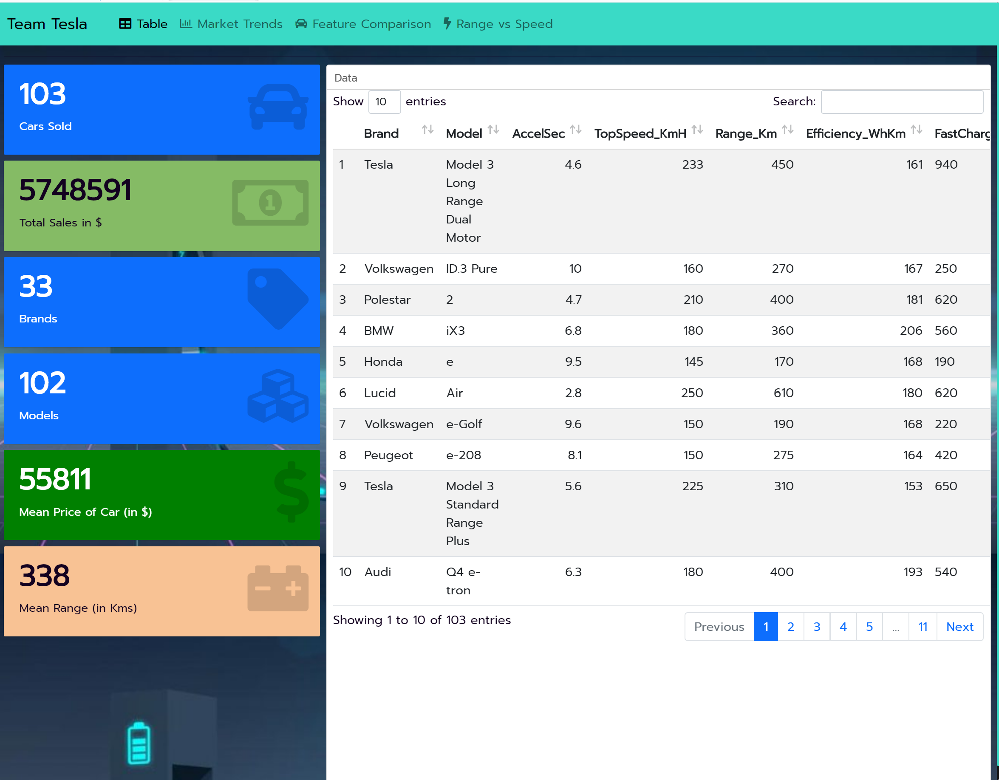
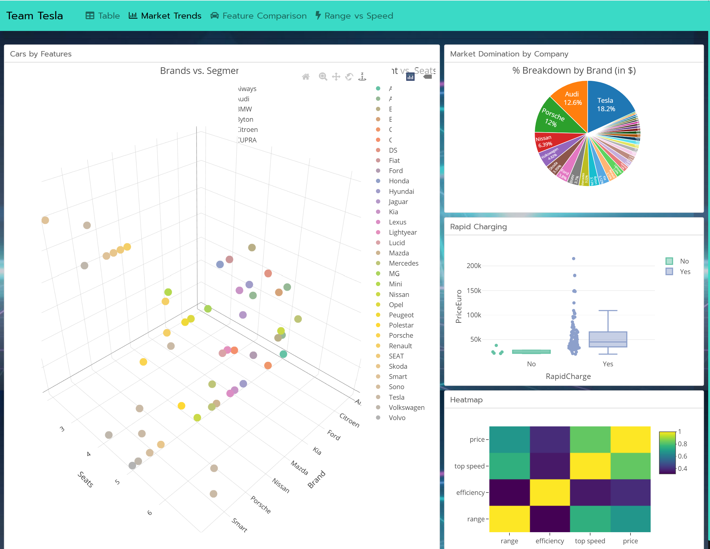

<p>	<h1 align="center"> Team Tesla 🏎️🔋</h1>
	<h3 align="center"> Understanding Sales of Electric Vehicles </h3>
</p>

> J Component for Data Visualization (CSE3020)

## Dependencies
 - Flex Dashboard
 - R Language
 
 - R Packages:
   - plotly
   - Tidyverse
   - ggplot2
   - reshape2
   - DT


## Running


Directions to install 
```bash
git clone https://github.com/VisheshBansal/Team-Tesla
cd Team-Tesla
```

Directions to execute

```R
- Open in RStudio
- Click on Knit
```
### Screenshots

<p align="center">


</p>

## Contributors

<table>
	<tr align="center">
		<td>
		Vishesh Bansal
		<p align="center">
			
		</p>
			<p align="center">
				<a href = "https://github.com/VisheshBansal">
					
				</a>
			</p>
		</td><td>
		Ishita Chauhan
		<p align="center">
			
		</p>
			<p align="center">
				<a href = "https://github.com/ishizzz">
					
				</a>
			</p>
		</td><td>
		Avineesh Sathyakumar
		<p align="center">
			
		</p>
			<p align="center">
				<a href = "https://github.com/Avineesh28">
					
				</a>
			</p>
		</td><td>
		Nikita Bisht
		<p align="center">
			
		</p>
			<p align="center">
				<a href = "https://github.com/NikitaBisht2605">
					
				</a>
			</p>
		</td>
	</tr>
</table>

<p align="center">
	Made with :heart: by <a href="https://github.com/VisheshBansal">Team Tesla</a>
</p>
